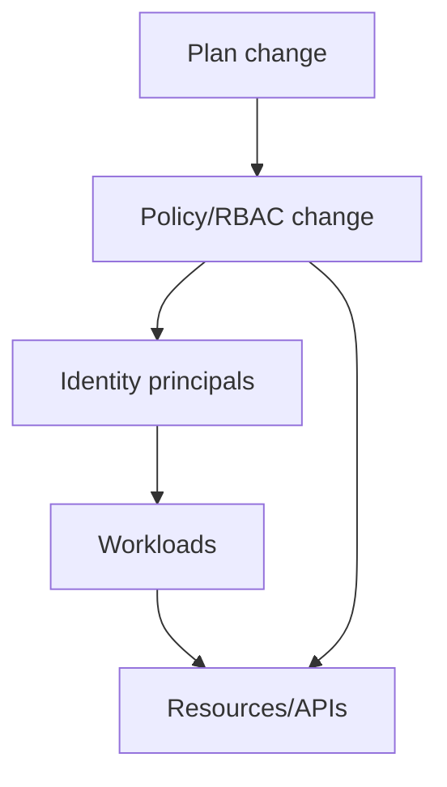
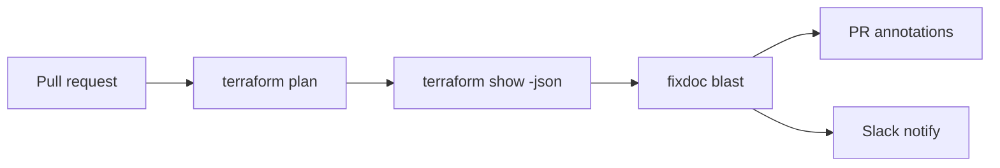

# FixDoc Blast Radius Feature

## Executive summary
A FixDoc “blast radius” feature should estimate and clearly explain **which identities, workloads, and downstream resources are most likely to be affected by infrastructure changes before they’re applied**, especially high-leverage “control-plane” edits like IAM/RBAC/policy and network boundary changes. The most actionable v0–v1 design is **local-first and explainable**: ingest a Terraform plan JSON (`terraform show -json`) plus a Terraform dependency graph (`terraform graph`), correlate change patterns with FixDoc’s historical fixes/tags, compute an affected set via bounded graph traversal, and emit a **weighted BlastScore** with concrete preflight checks. Terraform provides both the JSON plan representation and the graph output needed for this approach. citeturn2view0turn6view1turn6view2  
v1–v2 should add optional dynamic validators—Kubernetes authorization spot-checks and cloud policy validation APIs—to reduce false positives and raise confidence while keeping the core provider-agnostic through plugins. Kubernetes explicitly supports interactive “can I?” checks via `kubectl auth can-i` (SelfSubjectAccessReview), and AWS IAM Access Analyzer provides policy validation findings. citeturn6view3turn6view4

## Problem statement and user scenarios
Infrastructure change risk often comes from *reach*: one small RBAC/IAM/policy edit can affect many users and services. This is amplified by cloud authorization semantics: explicit denies can override allows and policy intersections (e.g., boundaries) can unexpectedly remove access. citeturn7view0

Developer: A dev updates Kubernetes RBAC, then a deployment fails because the workload’s service account can’t read configmaps/secrets or list resources. Kubernetes RBAC is designed to control access via the API, and bindings are evaluated during authorization decisions. citeturn6view7

SRE: An SRE wants a pre-merge warning when Terraform changes touch authorization primitives or network edges that historically cause outages or lengthy debugging.

Platform engineer: A platform engineer needs CI guardrails for high-risk changes (e.g., switching authorization models). Example: Azure Key Vault supports both access policies and Azure RBAC, and Microsoft documents migration from access policies to Azure RBAC—this class of change is inherently high blast radius because it changes the access control model and role assignment surfaces. citeturn6view5

## Data sources and required context bundle
The blast radius estimator should combine **static IaC evidence**, **local operational history**, and optional **dynamic validation**.

Static, local-first inputs for v0–v1:
- `~/.fixdoc/fixes.json` + FixDoc tags/notes (empirical “what breaks here” priors).
- Terraform plan JSON from `terraform show -json <planfile>`: includes `resource_changes`, `planned_values`, metadata like `applyable/complete/errored`, and “sensitive values” indicators via `sensitive_values`. citeturn2view0turn6view0
- Terraform dependency graph: `terraform graph` emits DOT graphs of config/plan dependencies. citeturn6view1turn6view2
- `kubectl diff` output in K8s-focused workflows and CI gating (exit codes distinguish “differences” vs errors). citeturn1search4

Dynamic enrichment for v1–v2 (optional, plugin-based):
- Kubernetes: `kubectl auth can-i` uses the SelfSubjectAccessReview API to test whether an action is allowed for the current identity (and can be paired with impersonation). citeturn6view3
- AWS: IAM Access Analyzer `ValidatePolicy` returns findings (actionable recommendations) for candidate policies. citeturn6view4
- Azure/GCP: treat authorization model changes using primary semantics from provider docs (e.g., Key Vault model migration; GCP allow/deny policies). citeturn6view5turn6view6turn8view0

Required “context bundle” fields (store at fix-capture time and analysis time) to make blast estimates meaningful in small-to-medium orgs:
- Identity: principal identifier(s) (user/role/service account), plus “impersonation target” for checks.
- Scope: environment (dev/stage/prod), account/subscription/project, cluster context, namespace.
- Resource addressing: Terraform resource address + provider type; K8s kind/name/namespace; region.
- Permission surface: verbs/actions changed, role/binding identifiers, condition/policy references.
- Network context: VPC/VNet, subnet, ingress/egress boundary identifiers.
- Git context: repo, branch, commit SHA, PR ID, workspace.
- Reliability metadata: timestamps, tool versions, “time-to-fix” (optional).

## Dependency modeling approaches
Blast radius requires propagating impact from “what changed” to “what depends on it.” Terraform already builds dependency graphs from configuration references, explicit `depends_on`, provider configuration dependencies, and even destroy/create ordering, and it traverses the graph during operations. citeturn6view2turn6view1

| Dependency model | Data sources | Strengths | Trade-offs |
|---|---|---|---|
| Resource graph | Terraform graph + plan JSON | Fast, IaC-native, provider-agnostic; ideal for CI | Misses runtime request flows and informal dependencies |
| Service graph | K8s labels/selectors + service catalog ownership | Maps to owners and “what customers feel” | Needs conventions/correct metadata; partial without catalog |
| Call graph | Traces/APM/service mesh telemetry | Highest fidelity “real blast” | Requires telemetry, storage, and correlation; usually enterprise |

Mermaid model for a minimal unified graph (policy as a control point feeding identity/workload/resource reachability):


## Blast radius estimation algorithms and scoring
### Static plan analysis
Use the plan JSON as the authoritative “change list.” Terraform’s JSON plan representation explicitly enumerates `resource_changes` and provides `planned_values` and `sensitive_values` patterns for consumers. citeturn2view0turn6view0  
Algorithm core:
1. Extract changed nodes from `resource_changes[]` (address, type, action, before/after presence).
2. Classify “control point” changes: IAM/RBAC/policy resources, role assignments/bindings, and network boundary objects.
3. Build/ingest a graph from `terraform graph` DOT; compute reachability from changed nodes across dependencies. citeturn6view1turn6view2

### Tag-based propagation using FixDoc history
Use FixDoc tags as priors: when a change touches a resource type/category that appears in past fixes (e.g., `rbac`, `access denied`, specific resource types), increase the expected impact weight. This converts tribal knowledge into a quantitative bias without requiring cloud lock-in.

### Transitive closure and bounded propagation
Compute the “affected set” using bounded BFS/DFS:
- Start set: changed control points and directly modified resources.
- Traverse: Terraform dependencies ∪ “semantic edges” (e.g., RBAC binding → subject principal → namespace workloads).
- Boundaries: max depth, environment scope, account/project scope, and “stop nodes” (leaf resources) to prevent runaway graphs.

### Dynamic signals for confidence calibration
Use dynamic checks as *confidence modifiers*, not hard dependencies:
- Kubernetes: `kubectl auth can-i` checks authorization via SelfSubjectAccessReview, providing concrete yes/no for key verbs/resources. citeturn6view3
- AWS: Validate changed policies via Access Analyzer `ValidatePolicy` and attach findings. citeturn6view4
Cloud semantics matter: explicit denies can override allows; policy intersections (e.g., boundaries) can reduce permissions even if a policy “looks permissive” in isolation. citeturn7view0  
GCP adds “deny policies” that are evaluated before allow policies and can apply down the resource hierarchy, implying high blast potential for deny-policy edits. citeturn8view0

### Weighted impact scoring formula
Produce two outputs: (a) affected entities, (b) a normalized severity score.

Define:
- `R` = number of affected nodes (weighted by node type: principal/workload > leaf resource)
- `C` = criticality (prod > staging > dev; shared components > isolated)
- `Δ` = change weight (create < update < replace/delete)
- `H` = history prior (tag match strength + recurrence)

Score:
\[
BlastScore = 100 \cdot \sigma(a\ln(1+R) + bC + c\Delta + dH)
\]
Where `σ` is a logistic function for stable 0–100 scaling, and coefficients `a,b,c,d` are tunable per org.

## UX, CLI outputs, CI, and integrations
### CLI warnings and explainability
FixDoc should output: **severity**, **what changed**, **who/what is affected**, **why** (paths), and **next checks**.

Sample CLI output (human):
```text
X BLAST HIGH (82/100): RBAC/IAM change likely impacts 14 principals (prod)
  Change: kubernetes_cluster_role_binding.payments (update)
  Why: Policy→Binding→ServiceAccount→Deployment (depth 4)
  Related history: FIX-a1b2 (“access denied”, tags: rbac)
  Next: kubectl auth can-i get secrets -n payments --as system:serviceaccount:payments:api
```

Sample JSON output (machine):
```json
{
  "analysis_id": "BR-2026-02-12T23:10:00Z",
  "score": 82,
  "severity": "high",
  "changes": [{"address":"kubernetes_cluster_role_binding.payments","action":"update"}],
  "affected": [{"kind":"ServiceAccount","namespace":"payments","name":"api"}],
  "why_paths": [["Policy","Binding","ServiceAccount","Deployment"]],
  "checks": [{"type":"kubectl_auth_can_i","status":"recommended"}]
}
```

### GitHub Actions integration
Terraform JSON generation is standard via `terraform show -json <FILE>`. citeturn6view0turn2view0  
GitHub Actions supports log annotations via workflow commands like `::warning`/`::error`. citeturn6view8

```yaml
name: fixdoc-blast
on: [pull_request]
jobs:
  blast:
    runs-on: ubuntu-latest
    steps:
      - uses: actions/checkout@v4
      - run: terraform plan -out=plan.tfplan
      - run: terraform show -json plan.tfplan > plan.json
      - run: fixdoc blast plan.json --format github --fail-on high
```

Mermaid CI flow:


### Collaboration and knowledge surfaces
- Git sync remains the OSS “team sharing” primitive (your current model).
- Backstage integration: use the catalog’s JSON REST API to map affected resources to owners; publish generated markdown to TechDocs (docs-as-code). citeturn6view10turn6view11
- Slack: use incoming webhooks (JSON payload) to alert #infra-changes when severity is high. citeturn6view9

## Schemas, privacy, roadmap, metrics, and risks
### Sample JSON schemas
Fix entry schema (minimal, blast-relevant fields):
```json
{
  "$id": "https://fixdoc.dev/schema/fix.json",
  "type": "object",
  "required": ["id","issue","resolution","tags","ctx"],
  "properties": {
    "id": {"type":"string"},
    "issue": {"type":"string"},
    "resolution": {"type":"string"},
    "tags": {"type":"array","items":{"type":"string"}},
    "ctx": {
      "type":"object",
      "required":["cloud","region","principal","tf_addr","git_sha","ts"],
      "properties": {
        "cloud":{"type":"string"},
        "region":{"type":"string"},
        "principal":{"type":"string"},
        "namespace":{"type":"string"},
        "tf_addr":{"type":"string"},
        "git_sha":{"type":"string"},
        "ts":{"type":"string","format":"date-time"}
      }
    }
  }
}
```

Example fix entry (RBAC migration class):
```json
{
  "id": "FIX-a1b2c3d4",
  "issue": "Key vault access denied after auth model change",
  "resolution": "Mapped prior access policies to RBAC roles; assigned at vault scope",
  "tags": ["rbac","iam","azurerm_key_vault","access_denied"],
  "ctx": {
    "cloud": "azure",
    "region": "eastus",
    "principal": "mi/payments-api",
    "tf_addr": "azurerm_key_vault.kv",
    "git_sha": "abc1234",
    "ts": "2026-02-12T20:10:00Z"
  }
}
```

Blast analysis schema (minimal):
```json
{
  "$id": "https://fixdoc.dev/schema/blast.json",
  "type": "object",
  "required": ["analysis_id","score","severity","changes","affected"],
  "properties": {
    "analysis_id": {"type":"string"},
    "score": {"type":"integer","minimum":0,"maximum":100},
    "severity": {"type":"string","enum":["low","medium","high","critical"]},
    "changes": {"type":"array"},
    "affected": {"type":"array"},
    "why_paths": {"type":"array","items":{"type":"array","items":{"type":"string"}}},
    "checks": {"type":"array"}
  }
}
```

### Privacy and redaction rules
- Treat plan JSON and captured error excerpts as sensitive by default.
- Terraform warns that `terraform show -json` can display sensitive state values in plaintext; therefore FixDoc should (a) redact common secret patterns, (b) allow “store only allowlisted fields,” and (c) store sensitivity metadata where possible (plan JSON’s sensitivity structures help). citeturn6view0turn2view0

### Implementation roadmap and effort
v0–v1 (high leverage, local-first; roughly 3–6 weeks full-time for one engineer):
- Plan ingestion: parse `resource_changes`/actions, detect control points. citeturn2view0
- Graph ingestion: parse `terraform graph` DOT; compute bounded reachability and “why paths.” citeturn6view1turn6view2
- History prior: tag-match + recurrence weighting from fixes.json.
- Output formats: human CLI + JSON + GitHub annotation formatting using workflow commands. citeturn6view8
- Redaction + safe defaults, with explicit warning about `show -json`. citeturn6view0

v1–v2 (confidence + org mapping; 6–12+ weeks full-time):
- Kubernetes dynamic checks: recommend or run `auth can-i` for top affected identities. citeturn6view3
- Cloud validator plugins: AWS `ValidatePolicy` integration; stub interfaces for Azure/GCP validations. citeturn6view4
- Service mapping: Backstage catalog ownership lookup + TechDocs publishing pipeline for blast reports. citeturn6view10turn6view11
- Noise reduction: baselining + regression tracking (compare blast deltas per workspace/PR).

### Open-source vs enterprise split
Open-source (traction + trust):
- Local blast computation, explainability paths, JSON outputs, Git sync, and CI formatting.
Enterprise (monetizable at org scale):
- Centralized org-wide index, RBAC/SSO/audit logs, governance “policy packs,” managed cloud API enrichment, dashboards, and alert routing.

### Metrics and risks
Metrics:
- Precision/false positives (warnings that did not correspond to real impact).
- Recall proxy (post-incident: “would this have warned?” tagging).
- MTTR reduction for repeat failure classes after adoption.
- Adoption: weekly active users, fixes captured per engineer-week, CI runs per PR, “warning acknowledged” rate.

Risks and mitigations:
- Noise from incomplete dependency knowledge → bounded traversal, confidence levels, “why path” transparency.
- Missing runtime call paths → optional call-graph plugins (v2) and explicit model labeling (RG vs SG vs CG).
- Sensitive data leakage → redaction defaults + allowlisting + explicit `show -json` caution. citeturn6view0